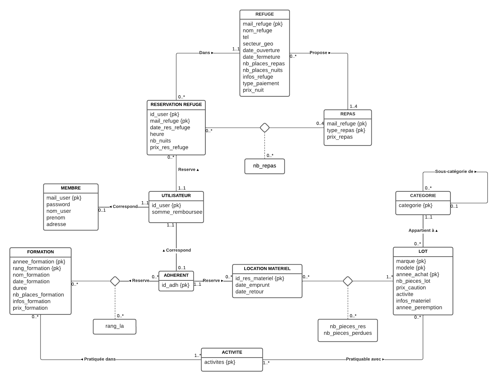

Ce projet réalisé en Java avec Oracle, pour la gestion des données, permet de gérer les services proposés par un club de montagne à ses adhérents et au grand public. Son fonctionnement est le suivant : 
- L'ensemble des utilisateurs inscrits sur ce système ont la possibilité de faire des réservations de repas/nuits dans les refuges gérés par le club
- Seuls les adhérents du club ont la possibilité de s'inscrire à des formations et de réserver du matériel pour leurs sorties en montagne

## Configuration requise
Comme spécifié plus haut, ce projet est réalisé avec Oracle. Il vous faut donc :
- Installer Oracle 11g sur votre système
- Créer une base de données et la peupler en exécutant respectivement les fichiers tables.sql et insertion.sql situé dans le répertoire src/database.
- Éditer les 3 premières lignes de la classe JDBC pour établir la connexion à la bd créée
- Pour exécuter le démonstrateur, il suffit d’entrer la commande **make** dans le répertoire racine du
projet.

## Analyse statique

### Propriétés

- mail_refuge, nom_refuge, tel, secteur_geo, date_ouverture, date_fermeture, nb_places_repas, nb_places_nuits, infos_refuge, type_paiement, prix_nuit, type_repas, prix_repas
- annee_formation, rang_formation, nom_formation, date_formation, duree, nb_places_formation, infos_formation, prix_formation, activite
- marque, modele, annee_achat, categorie, nb_pieces_lot, prix_caution, infos_materiel, annee_peremption
- sous_categorie
- id_user, mail_user, password, nom_user, prenom, adresse, id_adh
- date_res_refuge, heure, nb_nuits, nb_repas, prix_res_refuge
- rang_la
- id_res_materiel, nb_pieces_res, date_emprunt, date_retour, nb_pieces_perdues
- cout_res_refuge, cout_res_formation, somme_due, somme_remboursee

### Dépendances fonctionelles

- mail_refuge $\to$ nom_refuge, tel, secteur_geo, date_ouverture, date_fermeture, nb_places_repas, nb_places_nuits, infos_refuge, type_paiement, prix_nuit
- mail_refuge, type_repas $\to$ prix_repas
- annee_formation, rang_formation $\to$ nom_formation, date_formation, duree, nb_places_formation, infos_formation, prix_formation, activite
- marque, modele, annee_achat $\to$ categorie, nb_pieces_lot, prix_caution, activite, infos_materiel, annee_peremption
- sous_categorie $\to$ categorie
- id_user $\to$ mail_user, password, nom_user, prenom, adresse, id_adh
- id_adh $\to$ id_user
- id_user, mail_refuge $\to$ date_res_refuge, heure, nb_nuits, type_repas
- id_user, mail_refuge, type_repas $\to$ nb_repas
- id_user, mail_refuge, nb_nuits, nb_repas $\to$ prix_res_refuge
- id_adh, annee_formation, rang_formation $\to$ rang_la
- id_res_materiel $\to$ id_adh, marque, modele, annee_achat, date_emprunt, date_retour
- id_res_materiel, marque, modele, annee_achat $\to$ nb_pieces_res, nb_pieces_perdues
- id_user $\to$ cout_res_refuge, cout_res_formation, somme_due, somme_remboursee

### Contraintes de valeur

- type_paiement $\in$ {espèce, chèque, carte-bleue}
- type_repas $\in$ {déjeuner, dîner, souper, casse-croûte}
- {randonnée, escalade, alpinisme, spéléologie, ski de rando, cascade de glace} $\subseteq$ $\mathrm{Ext}$(activite)
- date_ouverture < date_fermeture
- annee_achat < annee_peremption
- nb_nuits ≤ nb_places_nuits
- nb_pieces_res ≤ nb_pieces_lot
- date_emprunt ≤ date_retour ≤ date_emprunt + 14 j
- nb_pieces_perdues ≤ nb_pieces_res
- somme_remboursee ≤ somme_due
- nb_places_repas, nb_places_nuits, prix_nuit, prix_repas, rang_formation, duree, nb_places_formation, prix_formation, nb_pieces_lot, prix_caution, id_user, id_adh, prix_res_refuge, id_res_materiel, nb_pieces_res > 0
- nb_nuits, nb_repas, rang_la, nb_pieces_perdues, cout_res_refuge, cout_res_formation, somme_due, somme_remboursee ≥ 0

### Contraintes de multiplicité

- mail_refuge $\nrightarrow$ tel
- mail_refuge $\twoheadrightarrow$ type_repas
- annee_formation, rang_formation $\twoheadrightarrow$ activite
- marque, modele, annee_achat $\twoheadrightarrow$ activite
- marque, modele, annee_achat $\nrightarrow$ infos_materiel
- marque, modele, annee_achat $\nrightarrow$ annee_peremption
- categorie -|->> sous_categorie
- sous-categorie $\nrightarrow$ categorie
- id_user $\nrightarrow$ mail_user, password, nom_user, prenom, adresse
- id_user $\nrightarrow$ id_adh
- id_user, mail_refuge -|->> type_repas
- id_res_materiel $\twoheadrightarrow$ marque, modele, annee_achat

### Contraintes contextuelles

- Les catégories de matériels sont organisées en un arbre avec des sous-catégories
- Un membre peut uniquement faire des réservations dans les refuges. Seuls les adhérents peuvent s'inscrire à des formations et emprunter du matériel
- Les membres ont la possibilité de réserver pour un seul ou plusieurs repas dans la journée. Ils peuvent également ne réserver que des repas sans la nuitée ou inversement
- Prise en compte de la liste d'attente pour les formations
- Lors de la perte/casse de matériel, ceux-ci doivent être retirés des lots et la somme due par l'adhérent doit être calculée
- Prise en compte du droit à l'oubli

## Schéma Entités/Associations

## Schéma relationnel

- **refuge** : {<ins>mail_refuge</ins>, nom_refuge, tel, secteur_geo, date_ouverture, date_fermeture, nb_places_repas, nb_places_nuits, infos_refuge, type_paiement, prix_nuit}
- **repas** : {<ins>mail_refuge</ins>, <ins>type_repas</ins>, prix_repas}
- **formation** : {<ins>annee_formation</ins>, <ins>rang_formation</ins>, nom_formation, date_formation, duree, nb_places_formation, infos_formation, prix_formation}
- **activite** : {<ins>activite</ins>}
- **activites_formation** : {<ins>annee_formation</ins>, <ins>rang_formation</ins>, <ins>activite</ins>}
- **categorie** : {<ins>categorie</ins>}
- **sous_categorie** : {<ins>sous_categorie</ins>, categorie}
- **lot** : {<ins>marque</ins>, <ins>modele</ins>, <ins>annee_achat</ins>, categorie, nb_pieces_lot, prix_caution, activite, infos_materiel, annee_peremption}
- **activites_lot** : {<ins>marque</ins>, <ins>modele</ins>, <ins>annee_achat</ins>, <ins>activite</ins>}
- **membre** : {<ins>mail_user</ins>, password, nom_user, prenom, adresse}
- **utilisateur** : {<ins>id_user</ins>, mail_user, somme_remboursee}
- **adherent** : {<ins>id_adh</ins>, id_user}
- **reservation_refuge** : {<ins>id_user</ins>, <ins>mail_refuge</ins>, date_res_refuge, heure, nb_nuits}
- **quantite_repas** : {<ins>id_user</ins>, <ins>mail_refuge</ins>, <ins>type_repas</ins>, nb_repas}
- **reservation_formation** : {<ins>id_adh</ins>, <ins>annee_formation</ins>, <ins>rang_formation</ins>, rang_la}
- **location_materiel** : {<ins>id_res_materiel</ins>, id_adh, date_emprunt, date_retour}
- **quantite_materiel** : {<ins>id_res_materiel</ins>, <ins>marque</ins>, <ins>modele</ins>, <ins>annee_achat</ins>, nb_pieces_res, nb_pieces_perdues}
